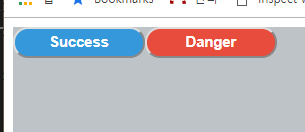

# React Styled-Component

- [노마드 코더 styled-components](https://academy.nomadcoders.co)
- [공식홈](https://www.styled-components.com/docs)

## Basic

- `styled-components` 을 사용해서 스타일링 할 수 있다.
- `this` -> `&` 로 내부에서 사용가능
- `props` 도 사용 가능하다.

```
import React, { Component, Fragment } from 'react';
import styled from 'styled-components';


class App extends Component {
  render() {
    return (
      <Container>
        <Button>Success</Button>
        <Button danger>Danger</Button>
      </Container>
    );
  }
}

const Container = styled.div`
  height: 100vh;
  width: 100%;
  background-color: #bdc3c7;
`

const Button = styled.button`
  border-radius: 50px;
  padding: 5px;
  min-width: 120px;
  color: white;
  font-weight: 600;
  -webkit-appearance: none;
  cursor: pointer;
  &:active,
  &:focus {
    outline: none;
  }
  background-color: ${props => props.danger ? "#e74c3c" : "#3498db"}
`

export default App;

```


### GlobalStyle 적용시

```
import React, { Component, Fragment } from 'react';
import styled, { createGlobalStyle } from 'styled-components';

const GlobalStyle = createGlobalStyle`
  body {
    margin: 100px;
    padding: 100px;
    background-color: red;
  }
`

class App extends Component {
  render() {
    return (      
        <Container>
          <GlobalStyle />
          <Button>Success</Button>
          <Button danger>Danger</Button>
        </Container>           
    );
  }
}

const Container = styled.div`
  height: 300px;
  width: 300px;  
  background-color: blue;
`

const Button = styled.button`
  border-radius: 50px;
  padding: 5px;
  min-width: 120px;
  color: white;
  font-weight: 600;
  -webkit-appearance: none;
  cursor: pointer;
  &:active,
  &:focus {
    outline: none;
  }
  background-color: ${props => props.danger ? "#e74c3c" : "#3498db"}
`

export default App;

```


### extenstion

기존 컴포넌트를 확장해서 새로운 태그를 만들어낼 수 있다.

```
const Anchor = Button.withComponent("a");

<Anchor href="http://naver.com">Go to Naver</Anchor>
```

추가적으로 더 확장을 할 수 있다. 

이전버전에서는 `.extend` 로 가능했지만 새로 바뀐 내용은 `styled` 로 묶어줘야 한다. 

```
// a tag 밑줄 제거

const Anchor = styled(Button.withComponent("a"))`
  text-decoration:none;
`;
```

### animation

- `css, keyframes` 추가
- `keyframe`
- `props`에 `duration` 설정 후 `styled-components` 에서 속성으로 사용가능

```
import React, { Component, Fragment } from 'react';
import styled, { createGlobalStyle, css, keyframes } from 'styled-components';

const GlobalStyle = createGlobalStyle`
  body {
    margin: 100px;
    padding: 100px;
    background-color: red;
  }
`

class App extends Component {
  render() {
    return (      
        <Container>
          <GlobalStyle />
          <Button>Success</Button>
          <Button danger duration={1}>Danger</Button>
          <Anchor href="http://naver.com">Go to Naver</Anchor>
        </Container>           
    );
  }
}

const Container = styled.div`
  height: 300px;
  width: 700px;  
  background-color: blue;
`

const Button = styled.button`
  border-radius: 50px;
  padding: 5px;
  min-width: 120px;
  color: white;
  font-weight: 600;
  -webkit-appearance: none;
  cursor: pointer;
  &:active,
  &:focus {
    outline: none;
  }
  background-color: ${props => props.danger ? "#e74c3c" : "#3498db"}
  ${props => {
    if(props.danger) {
      return css`animation: ${rotation} ${props.duration}s linear infinite`
    }
  }}
`

const Anchor = styled(Button.withComponent("a"))`
  text-decoration:none;
`;

const rotation = keyframes`
  from{
    transform: rotate(0deg);
  }
  to{
    transform: rotate(360deg);
  }
`

export default App;

```

### Theme

#### attrs

```
const Input = styled.input.attrs({
  required: true
})`
  border-radius: 5px;
`

class App extends Component {
  render() {
    return (      
        <Container>
          <GlobalStyle />          
          <Input placeholder="hello"/>
        </Container>           
    );
  }
}
```

#### css

컴포넌트에 `css`를 추가적으로 적용하고 싶을때

```
const awesomeCard = css`
  background-color: white;
  border-radius: 10px;
  padding: 20px;
`

const Input = styled.input.attrs({
  required: true
})`
  border-radius: 5px;  
  ${awesomeCard}
`
```

#### Global Theme

- 전체 APP 내 공통 색상을 정의를 해서 `props`로 사용이 가능하다. 

1. `ThemeProvider` 를 import 한다. 
2. `theme.js` 를 적용한다. 
3. `Component`에 props 로 추가한다. 
   1. `background-color: ${props => props.theme.successColor}`

```
import React, { Component } from 'react';
import styled, { createGlobalStyle, ThemeProvider } from 'styled-components';
import theme from './theme';

const GlobalStyle = createGlobalStyle`
  body {
    margin: 0px;
    padding: 0px;    
  }
`;


class App extends Component {
  render() {
    return (      
      <ThemeProvider theme={theme}>
        <Container>
          <GlobalStyle />          
          <Form />
        </Container> 
      </ThemeProvider>          
    );
  }
}

const Container = styled.div`
  height: 100%;
  width: 100vh;    
`

const Button = styled.button`
  border-radius: 30px;
  padding: 25px 15px;
  background-color: ${props => props.theme.successColor}
`

const Card = styled.div`
  background-color:white;
`

const Form = () => (
  <Card><Button>Hello</Button></Card>
)

export default App;

```

### Nesting

부모 컴포넌트에서 자식 컴포넌트 속성 체크를 할 수 있다.

```
const Container = styled.div`
  height: 100%;
  width: 100vh;    
  background-color: yellow;
  ${Card}{
    background-color: blue;
  }
`
```

이상으로 Styled-Components 기본 스터디 내용이었다. 